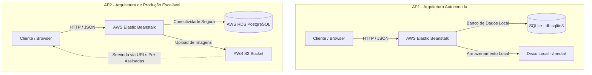

# Catalogo de Produtos - Django REST API (Evolução AP2)

API REST desenvolvida com Django e Django REST Framework para gerenciamento de produtos, categorias e pedidos (carrinho de compras), integrada com AWS RDS PostgreSQL e AWS S3, pronta para deploy na AWS Elastic Beanstalk.

## Integrantes do Grupo

- Daniel Maffezzoli

## Link da API Deployada

**URL da API na AWS:** http://catalogo-produtos-env.eba-z8mu8yce.us-east-2.elasticbeanstalk.com/ 

### Endpoints Disponíveis

*   `GET /api/categorias/` - Lista todas as categorias
*   `POST /api/categorias/` - Cria nova categoria
*   `GET /api/categorias/{id}/` - Detalhes de uma categoria
*   `PUT /api/categorias/{id}/` - Atualiza categoria
*   `DELETE /api/categorias/{id}/` - Remove categoria
*   `GET /api/produtos/` - Lista todos os produtos (suporta filtros avançados de JSONB)
*   `POST /api/produtos/` - Cria novo produto (com upload de imagem para o S3)
*   `GET /api/produtos/{id}/` - Detalhes de um produto
*   `PUT /api/produtos/{id}/` - Atualiza produto
*   `DELETE /api/produtos/{id}/` - Remove produto
*   `GET /api/pedidos/` - Lista todos os pedidos (carrinho de compras)
*   `POST /api/pedidos/` - Cria um novo pedido com itens associados
*   `GET /api/pedidos/{id}/` - Detalhes do pedido com seus itens e subtotal/total
*   `PUT /api/pedidos/{id}/` - Atualiza pedido e seus itens associados
*   `DELETE /api/pedidos/{id}/` - Remove pedido
*   `GET /admin/` - Interface administrativa do Django
*   `GET /` - Health check (retorna `{"status": "ok"}`)

---

## 1. Arquitetura da Solução (Evolução AP1 -> AP2)

Na **AP1**, a aplicação era executada de forma autocontida com banco de dados relacional SQLite (`db.sqlite3`) e armazenamento de arquivos de imagem em disco local (no diretório `media/`).

Na **AP2**, evoluímos o projeto para uma arquitetura na nuvem de nível de produção, separando as responsabilidades de computação, dados e armazenamento de arquivos de mídia:



### Principais Mudanças:
*   **AWS RDS (PostgreSQL)**: Substituiu o SQLite local. Garante alta disponibilidade, backups automáticos e isolamento dos dados.
*   **AWS S3 (Simple Storage Service)**: Substituiu o armazenamento em disco local da instância EC2. Permite que as instâncias escalem horizontalmente sem perder os uploads dos usuários.
*   **Segurança com Presigned URLs**: O S3 é mantido **100% privado** (bloqueio de acesso público ativo). O Django gera URLs pré-assinadas temporárias seguras para que o cliente acesse as imagens de mídia diretamente do S3 sem expor o bucket publicamente.

---

## 2. Tecnologias Utilizadas

*   **Python 3.12**
*   **Django 6.0.4**
*   **Django REST Framework 3.17.1**
*   **django-storages 1.14.6** & **boto3 1.43.25** (Integração com AWS S3)
*   **psycopg2-binary 2.9.12** (Driver de conexão com PostgreSQL)
*   **Terraform v1.14+** (Provisionamento automatizado da infraestrutura AWS)
*   **AWS Elastic Beanstalk** (Hospedagem da API)
*   **AWS RDS PostgreSQL 16.1** (Banco de dados de produção)
*   **AWS S3** (Armazenamento de mídia de produtos)

---

## 3. Como Configurar e Executar Localmente

O projeto está configurado de forma híbrida: por padrão, rodará com **SQLite** local e armazenamento **Local** de mídia, facilitando o desenvolvimento sem custo. Ao definir as variáveis de ambiente corretas, ele se conectará automaticamente ao **RDS PostgreSQL** e ao **AWS S3**.

### Passo 1: Clonar o Repositório e Acessar a Pasta
```bash
git clone <URL_DO_REPOSITORIO>
cd Ap1_BigData/catalogo-produtos
```

### Passo 2: Criar e Ativar Ambiente Virtual
**macOS/Linux:**
```bash
python3 -m venv .venv
source .venv/bin/activate
```
**Windows:**
```powershell
python -m venv .venv
.venv\Scripts\Activate.ps1
```

### Passo 3: Instalar Dependências
```bash
pip install -r requirements.txt
```

### Passo 4: Rodar as Migrações
```bash
python manage.py migrate
```

### Passo 5: Inicializar Dados de Teste (Bootstrap Command - BÔNUS)
Criamos um comando customizado para criar o usuário administrador padrão e popular o banco de dados com dados reais de produtos (incluindo metadados JSON flexíveis):
```bash
python manage.py bootstrap
```
*   **Usuário criado:** `admin`
*   **Senha criada:** `admin123`

### Passo 6: Iniciar o Servidor Local
```bash
python manage.py runserver
```
Acesse a API em [http://127.0.0.1:8000/api/](http://127.0.0.1:8000/api/).

---

## 4. Passo a Passo de Deploy (Infraestrutura do Zero)

Para evitar problemas com senhas expiradas ou segredos em texto puro, utilizamos **Terraform** para provisionar os recursos de banco e storage na AWS de forma automatizada.

### Passo 1: Provisionar RDS e S3 com Terraform
1. Certifique-se de ter credenciais AWS ativas no terminal:
   ```bash
   export AWS_ACCESS_KEY_ID="sua_chave_aqui"
   export AWS_SECRET_ACCESS_KEY="seu_segredo_aqui"
   export AWS_DEFAULT_REGION="us-east-1"
   ```
2. Inicialize e aplique o Terraform na pasta do projeto:
   ```bash
   terraform init
   terraform apply
   ```
3. Digite `yes` e confirme. Ao final da execução, o Terraform exibirá no terminal os blocos de variáveis de ambiente prontos para uso. **Copie o bloco gerado em `env_variables_eb`.**

### Passo 2: Configurar o Elastic Beanstalk
1. Acesse o console do **AWS Elastic Beanstalk**.
2. Vá em **Configuration** (Configuração) > **Updates, monitoring, and logging** (Atualizações, monitoramento e logs) > **Platform properties** (Propriedades da plataforma) / **Environment properties**.
3. Adicione as variáveis exibidas no output do Terraform:
   *   `DB_HOST` (Endpoint do RDS gerado)
   *   `DB_NAME` = `catalogodb`
   *   `DB_USER` = `postgres`
   *   `DB_PASSWORD` (Senha segura auto-gerada pelo Terraform)
   *   `DB_PORT` = `5432`
   *   `AWS_STORAGE_BUCKET_NAME` (Nome do bucket S3 gerado)
   *   `AWS_S3_REGION_NAME` = `us-east-1`
   *   `USE_S3` = `True`
   *   `DJANGO_SETTINGS_MODULE` = `catalogo.settings`
   *   `DJANGO_DEBUG` = `False`
   *   `DJANGO_ALLOWED_HOSTS` = `.elasticbeanstalk.com`

### Passo 3: Gerar Pacote de Deploy (`app.zip`)
Executar o script automatizado contido na raiz:
```bash
./deploy.sh
```
Isso gerará um arquivo `app.zip` limpo, sem diretórios de ambiente virtual (`.venv/`), base de dados local SQLite (`db.sqlite3`) ou arquivos temporários.

### Passo 4: Upload e Deploy
1. No console do Beanstalk, clique em **Upload and Deploy** (Fazer upload e implantar).
2. Escolha o arquivo `app.zip` recém-gerado.
3. Aguarde o ambiente concluir o deploy e ficar com o status **Ok** (Verde).

### Passo 5: Rodar Migrações e Inicialização em Produção
O arquivo `.ebextensions/django.config` já está configurado para executar `python manage.py migrate` e `collectstatic` automaticamente a cada deploy de líder.

Para rodar o bootstrap inicial no RDS de produção e criar o usuário `admin` com dados mockados:
1. Conecte-se via SSH à instância EC2 (usando `eb ssh` ou AWS Session Manager).
2. Execute o comando:
   ```bash
   cd /var/app/current/
   source /var/app/venv/*/bin/activate
   python manage.py bootstrap
   ```

---

## 5. Consultas Avançadas JSONB no PostgreSQL (BÔNUS)

Implementamos um campo do tipo `JSONField` (especificacoes) no modelo `Produto` para lidar com atributos específicos de diferentes categorias (ex.: RAM, CPU, cor, capacidade, voltagem).

### Como Consultar/Filtrar
Você pode testar filtros na API passando parâmetros de query diretamente nos endpoints. O backend traduzirá em filtros `JSONB` no PostgreSQL:

1.  **Filtro por Marca (Atributo JSON):**
    `GET /api/produtos/?marca=Dell`
2.  **Filtro por Memória RAM (Atributo JSON numérico):**
    `GET /api/produtos/?ram_gb=16`
3.  **Filtro por Cor (Atributo JSON):**
    `GET /api/produtos/?cor=preto`
4.  **Caso Combinado: Filtro Relacional + JSON (Categoria + Marca):**
    `GET /api/produtos/?categoria=1&marca=Apple`

---

## 6. Documentação de Decisões Técnicas e Troubleshooting

### Decisões Técnicas
*   **Substituição do SQLite por PostgreSQL (RDS)**: O uso de banco relacional robusto no RDS garante durabilidade ACID para operações críticas de e-commerce como o gerenciamento de pedidos e itens do pedido.
*   **S3 com Acesso Público Bloqueado + Presigned URLs**: Evita vazamento acidental de arquivos. O Django assina os links de imagens com validade temporária.
*   **Configuração do `AWS_DEFAULT_ACL = None`**: As versões recentes da AWS desencorajam ou bloqueiam por padrão o uso de ACLs públicas em buckets S3. Definir este parâmetro evita erros de permissão `AccessDenied` ao realizar uploads de imagens na API.
*   **Terraform para Provisionamento Automático**: Garante reprodutibilidade completa. Nenhuma credencial foi escrita em código. Toda senha é injetada dinamicamente nos outputs e configs.

### Troubleshooting (Resolução de Problemas)
*   **Erro `AccessDenied` no upload de Imagens:** Certifique-se de que a variável `AWS_DEFAULT_ACL` no `settings.py` está configurada como `None` e que a política de Object Ownership do bucket S3 está definida como default.
*   **Banco de Dados Inacessível da Máquina Local:** O Security Group criado via Terraform permite acesso à porta 5432 de qualquer IP para facilitar testes locais. Se o seu ambiente corporativo/rede bloquear portas externas, você pode precisar fazer o deploy das variáveis de ambiente e deixar que o Beanstalk execute a migração de forma automática.
